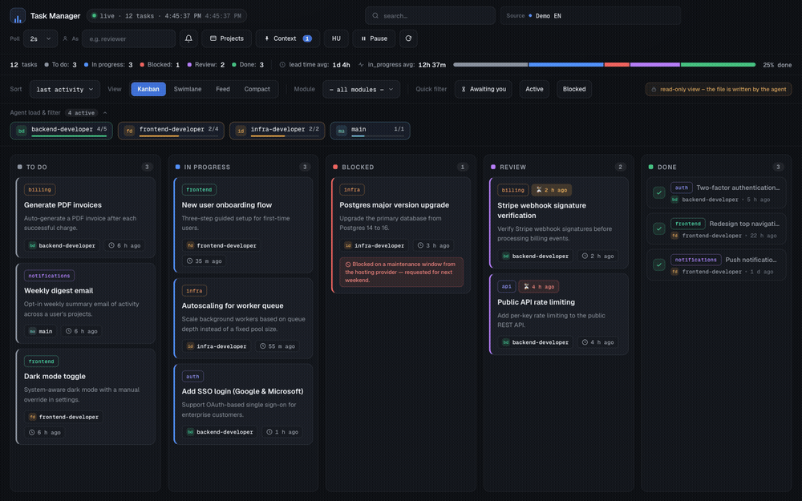
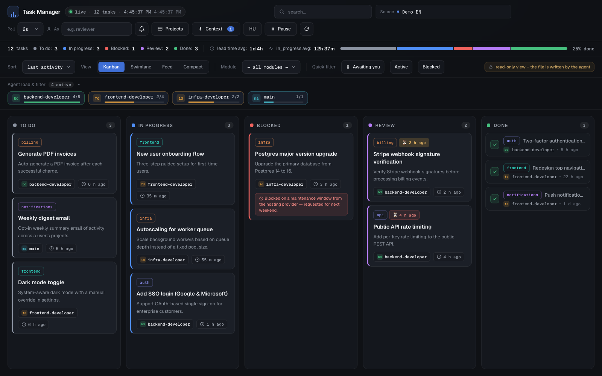
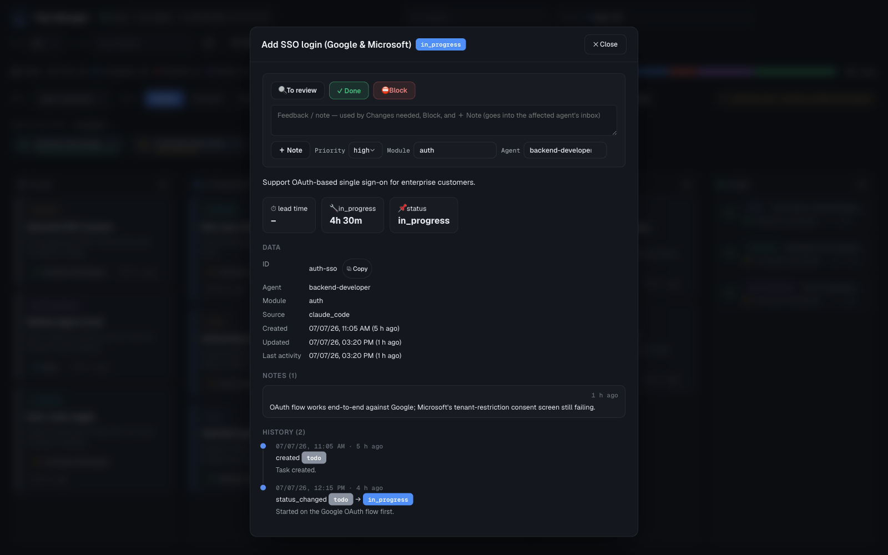
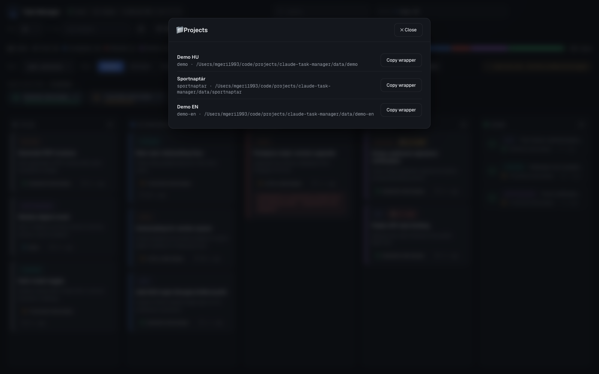
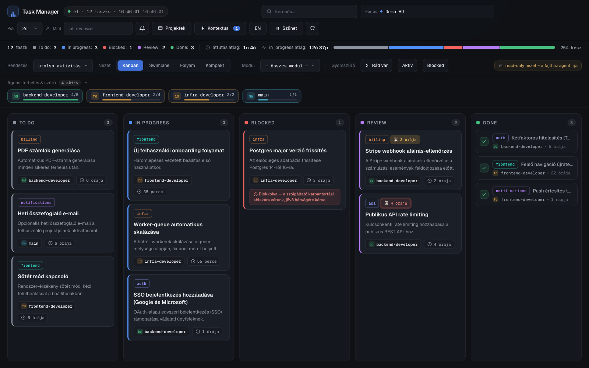
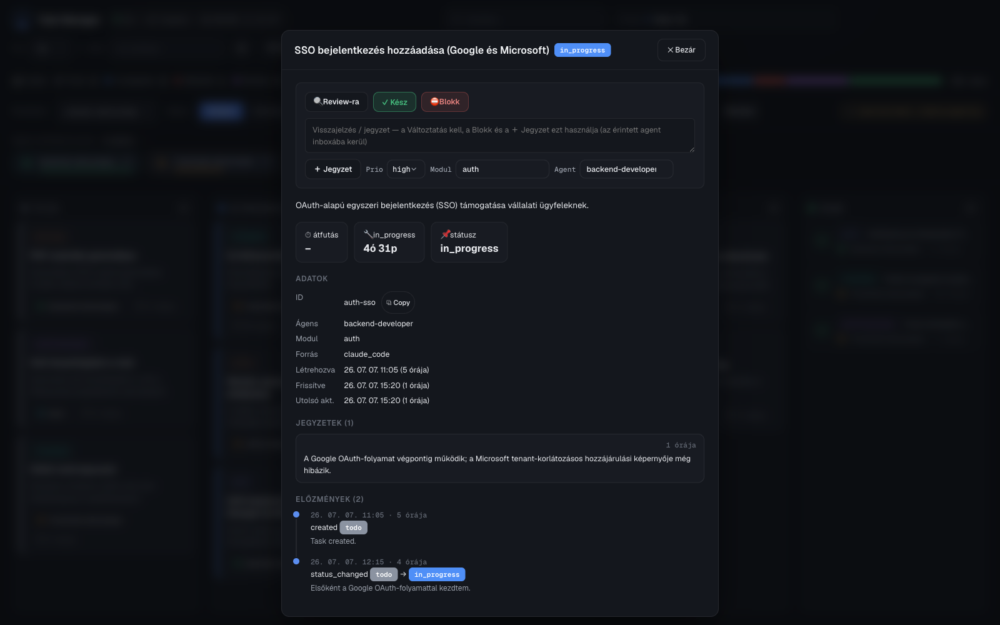
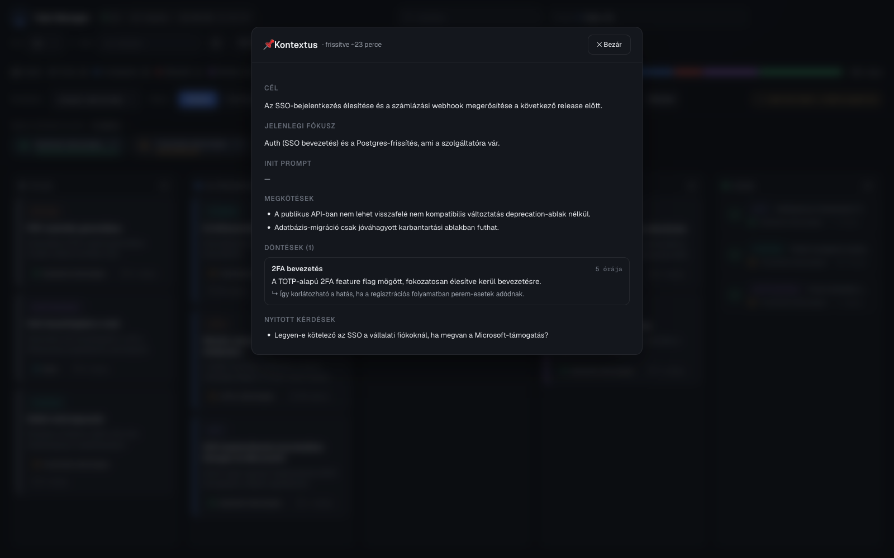

# claude-task-manager

[](https://www.npmjs.com/package/@mgeri1993/claude-task-manager)
[](https://www.npmjs.com/package/@mgeri1993/claude-task-manager)
[](LICENSE)

🌐 [English](README.md) | **Magyar**

Önálló, dockerizált, **több projektet** kiszolgáló Kanban task-manager Claude Code
agentek (fő agent + teammate-ek) koordinálásához. Egy közös böngészős board, egy
token-hatékony, `--as <agent>`-alapú `task.sh` CLI, modul-szűrés, és kétnyelvű
(angol/magyar) felület — bármelyik regisztrált projektből hívva, a CLI-hez docker nélkül.

## Képernyőképek



| Kanban board (angol) | Task-részlet (angol) | Projektek panel |
|---|---|---|
|  |  |  |

| Kanban board (magyar) | Task-részlet (magyar) | Kontextus panel |
|---|---|---|
|  |  |  |

## Telepítés

Szükséges: `git`, `bash`, `jq`, `docker` (a `docker compose` pluginnal) és `php` — ezek
csak akkor kellenek, ha a böngészős boardot is futtatod. Maga a `task.sh` CLI csak
`bash` + `jq`-t igényel, dockert nem.

```bash
git clone https://github.com/GeRiY/claude-task-manager.git
cd claude-task-manager
cp .env.example .env        # alap: board a 3333-as porton, autostart nélkül
```

Vagy, ha klónozás nélkül csak a `ctm` parancs kell:

```bash
npm install -g @mgeri1993/claude-task-manager
```

Ennyi — nincs build-lépés. Ezután jellemzően két dolgot csinálsz:

1. **Board indítása** (opcionális, csak a böngészős UI-hoz kell):
   ```bash
   ./bin/ctm up               # első futtatáskor image-et épít, 3333-as porton indul
   # vagy még a ctm parancs nélkül: docker compose up -d --build
   ```
2. **A `ctm` parancs globális regisztrálása** és **az eszköz telepítése egy projektbe**,
   hogy annak agentjei használhassák a `task.sh`-t:
   ```bash
   ln -s "$(pwd)/bin/ctm" ~/.local/bin/ctm   # győződj meg róla, hogy ~/.local/bin a PATH-adban van
   cd /path/to/valamelyik/masik/projekt
   ctm init                                  # regisztralja + telepiti ABBA a projektbe
   ```
   (A `ctm init` az első futtatáskor a `ctm` szimlinket is automatikusan regisztrálja, így
   a fenti kézi `ln -s` opcionális — csak akkor kell, ha bármilyen projektbe telepítés
   előtt szeretnéd elérhetővé tenni a `ctm`-et.)

A teljes parancs-referenciáért lásd a [Gyors indulás](#gyors-indulás) szekciót lentebb.

## Architektúra dióhéjban

- **`engine/task.sh`** — a tényleges Kanban-motor (jq-alapú, atomikus írás, lock,
  `events.jsonl`-alapú inbox-értesítés). `TM_DIR` env-változóval bármelyik projekt saját
  adat-könyvtárára mutatható. Minden futtatáskor stderr-emlékeztetőt ír, ha a projekt
  preferált nyelve (a boardról állítva) nem angol — lásd [Nyelv](#nyelv--i18n).
- **`engine/projects.sh`** — projekt-regisztráló admin CLI: minden regisztrált projekthez
  létrehoz egy `data/<id>/` adat-könyvtárat, és egy `wrappers/<id>.sh` wrappert, ami a
  `TM_DIR`-t és az engine abszolút útját már **beégetve** hordozza.
- **`data/<id>/`** — a projektek tényleges táblái (`tasks.json`, `context.json`,
  `events.jsonl`, `.cursors/`, `.board-lang`) — ITT élnek, nem a célprojektben.
- **`index.html` + `js/*` + `style.css`** — a böngészős board. Docker compose-szal
  szolgálja ki egy PHP beépített szerver; a Forrás-választó a `data/projects.json`
  regisztrált projektjei közt vált.
- **`api/index.php`** — a board ÍRÁS-endpointja: allowlistelt `task.sh` parancsokat futtat
  a kiválasztott projekt `TM_DIR`-jével (a böngésző sosem írja közvetlenül a JSON-t).
- **`install.sh`** / **`bin/ctm`** — egy tetszőleges célprojektbe telepíti a
  `.claude/skills/task-manager/` mappát (wrapper `task.sh` + `SKILL.md`), a generikus
  `ctm-*` teammate-agenteket, és az `allow-task-sh.sh` / `notify-inbox.sh` hookokat, majd
  bővíti a célprojekt Bash-allowlistjét.
- **`bin/add-agent.sh`** (`ctm agent add`) — egyedi, `tm-*` nevű teammate-definíció
  létrehozása egy már telepített projektben.
- **`engine/check-update.sh`** — az admin-jellegű scriptek (`ctm`, `install.sh`,
  `add-agent.sh`, `projects.sh`) forrásolják be, hogy sárga "van új verzió" jelzést
  írjanak ki — lásd [Naprakészen tartás](#naprakészen-tartás).

**Fontos:** a `task.sh`-hívásokhoz (agent-munkavégzés) **egyáltalán nem kell docker** — a
wrapperek sima host-bash scriptek. Kizárólag a böngészős **board** és az **API** fut
konténerben.

## Gyors indulás

### 1. A `ctm` parancs regisztrálása

Bármely telepítés (`install.sh` / `ctm init`) automatikusan regisztrálja a `ctm`-et a
PATH-on (`/usr/local/bin/ctm` vagy `~/.local/bin/ctm`, amelyik írható). Ha még sosem
futtattál telepítést, regisztrálhatod kézzel is:

```bash
ln -s /path/to/claude-task-manager/bin/ctm ~/.local/bin/ctm
# győződj meg róla, hogy a ~/.local/bin a PATH-adban van
```

### 2. Board indítása (docker)

```bash
ctm up            # alapértelmezett port: 3333 (lásd .env: CTM_PORT)
ctm up 4000        # más port — átírja a .env-et és újraindítja a konténert
```

A `ctm up` **idempotens**: ha a konténer már fut ugyanazzal a konfigurációval, nem csinál
semmit; ha nem fut, elindítja; ha a port változott, újraindítja. Ha a kért port már
foglalt egy MÁS folyamat által, egyértelmű hibával leáll, mielőtt dockert hívna.

```bash
ctm down                 # board leállítása
ctm autostart on|off     # docker restart-policy (unless-stopped / no) — gép/docker
                          # újraindításkor is magától elinduljon-e a board
```

A board ezután elérhető: `http://localhost:<port>/`. Az URL a `?project=<id>&lang=<en|hu>`
paramétereket is elfogadja, hogy egy adott projektre/nyelvre lehessen közvetlenül
mélylinkelni.

### 3. Telepítés egy projektbe

Bármelyik projekt gyökeréből (vagy a git-repóján belül bárhonnan) futtatva:

```bash
cd /path/to/valamelyik/projekt
ctm init                          # id/label = a mappa neve
ctm init sajat-id "Szép Név"      # explicit id/label
ctm init --force                  # felülírja a generált fájlokat rákérdezés nélkül
```

Ez létrehozza:

- `<projekt>/.claude/skills/task-manager/task.sh` — a projekt saját wrappere (`TM_DIR` +
  az engine abszolút útja beégetve; docker NEM szükséges).
- `<projekt>/.claude/skills/task-manager/SKILL.md` — Claude Code skill-dokumentáció
  (a `task.sh`-hívási kontraktus, workflow, `context.json` stb.) — projekt-agnosztikus.
- `<projekt>/.claude/agents/ctm-frontend-developer.md`, `ctm-backend-developer.md`,
  `ctm-code-investigator.md` — generikus teammate-definíciók (a konkrét stack-et a
  projekt saját dokumentációjából olvassák ki).
- `<projekt>/.claude/hooks/allow-task-sh.sh` + `notify-inbox.sh`, regisztrálva a
  `<projekt>/.claude/settings.json`-ban — automatikusan engedélyezi a `task.sh`
  Bash-hívásokat, és inbox-értesítést injektál a hívó agentnek minden `task.sh` futás után.
- `<projekt>/.claude/settings.local.json` — bővítve a `task.sh` Bash-allowlist
  bejegyzésével (engedélykérés nélkül).

Az újrafuttatott `ctm init` **idempotens** — ha egy generált fájl már létezik, rákérdez
felülírás előtt (kivéve `--force`/`-y`, vagy nem-interaktív módban, ahol kihagyja és
jelzi, hogy adj meg `--force`-ot). A `data/<id>/` tábla tartalmát sosem érinti, és a saját
`tm-*` egyedi agent-fájljaidhoz sem nyúl.

### 4. Egyedi teammate hozzáadása

Egy már telepített projektben, ha a 3 alap szerepkörön (frontend/backend/investigator)
felül másra is szükséged van:

```bash
cd /path/to/mar-telepitett-projekt
ctm agent add reviewer "Kódot review-z és minőségi kaput ellenőriz."
```

Létrehozza a `.claude/agents/tm-reviewer.md`-t. **Névkonvenció:** az `install.sh`/`ctm
init` generálta alap készlet mindig `ctm-*`; az így hozzáadott egyedi agentek mindig
`tm-*` — így egy pillantásra látszik, mi az automatikusan frissülő alap készlet és mi a
saját, kézzel szerkesztett kiegészítés (a `ctm init` a `tm-*` fájlokhoz sosem nyúl).

### 5. Projektek kezelése

```bash
ctm list                  # regisztrált projektek (id, címke, adat-könyvtár)
ctm wrapper <id>          # egy projekt generált wrapperének kiírása (kézi másoláshoz)
ctm rm <id> [--force]     # projekt törlése a regisztrációból (adat + wrapper) — rákérdez
```

## `task.sh` a projektből (docker nélkül)

A telepített wrapperen keresztül, a projekt saját `.claude/skills/task-manager/`-jéből:

```bash
/path/to/projekt/.claude/skills/task-manager/task.sh summary --as main
/path/to/projekt/.claude/skills/task-manager/task.sh list todo --as main
/path/to/projekt/.claude/skills/task-manager/task.sh list --module auth --as main
/path/to/projekt/.claude/skills/task-manager/task.sh add fix-1 "Bug fix" "leírás" --as main
/path/to/projekt/.claude/skills/task-manager/task.sh module fix-1 auth --as main
/path/to/projekt/.claude/skills/task-manager/task.sh status fix-1 in_progress --as main
```

Teljes parancslista: `task.sh help`. A hívási kontraktust (kötelező `--as`, csupasz-hívás
szabály, review→done átadási kör) a telepített `SKILL.md` írja le részletesen. A taskok
támogatnak egy opcionális `module` mezőt (szabad szöveg, pl. `auth`/`frontend`/`infra`)
csoportosításhoz/szűréshez — beállítás: `task.sh module <id> <név>`, szűrés:
`task.sh list --module <név>`, és a boardon is szűrhető.

## Nyelv / i18n

A board alapból **angol**. Kattints a fejléc nyelv-gombjára (vagy tedd hozzá az URL-hez
a `?lang=hu`-t) a **magyarra** váltáshoz — a választás megmarad `localStorage`-ban, és
tükröződik az URL-ben (`?lang=hu`), így egy board-link megosztható egy adott nyelven.

A nyelv **nem** kerül semelyik taskba vagy jegyzetbe. A board minden írása elküldi az
aktuális UI-nyelvet is; az `api/index.php` egy kis `data/<id>/.board-lang` fájlba menti
(nem a task-séma része). Az `engine/task.sh` minden futtatáskor beolvassa ezt a fájlt
(kivéve `help`/`inbox`, a zaj elkerülése végett), és — ha nem angol — egy emlékeztetőt ír
ki stderr-re, pl.:

```
[task-manager] Preferred language for this project: Hungarian — please reply and do the work in Hungarian.
```

Így tudja meg egy `task.sh`-t futtató agent (a Bash toolján keresztül), milyen nyelvet
használt a human a boardon, anélkül hogy ez az instrukció valaha is bekerülne a
task-adatokba.

## Naprakészen tartás

A `ctm`, `install.sh`, `add-agent.sh` és `projects.sh` mindegyike ellenőrzi (egy
könnyűsúlyú `git ls-remote`-tal, nem teljes fetch-csel), hogy az `origin` alapértelmezett
ágán van-e olyan commit, ami a lokális checkoutból hiányzik. Ha igen, sárga jelzést ír ki,
hogy futtass egy `git pull`-t; ha már naprakész vagy, nem ír ki semmit. Ez az ellenőrzés
**szándékosan nem** fut le az `engine/task.sh`-ban — azt a scriptet minden egyes
task-mutációnál meghívják (egy agent-sessionben gyakran sokszor), és egy hálózati
körüljárás minden hívásnál valós, ismétlődő késleltetést adna a hot path-hoz.

## Könyvtárszerkezet

```
claude-task-manager/
  engine/task.sh, projects.sh, check-update.sh   # a motor + projekt-admin CLI + frissítés-ellenőrzés
  bin/ctm, add-agent.sh                          # a "ctm" parancssori belépési pont
  install.sh                                     # egy célprojekt telepítője (a ctm init hívja)
  templates/                                     # SKILL.md / ctm-* / tm-custom / hooks sablonok (__PLACEHOLDER__-ekkel)
  api/index.php                                  # a board írás-endpointja
  index.html, js/, style.css                     # a böngészős board
  favicon.svg, favicon.ico                       # board favicon
  data/<id>/                                     # projektenkénti tábla (gitignore-olva)
  wrappers/<id>.sh                               # generált, projektenkénti task.sh wrapperek (gitignore-olva)
  docker-compose.yml, Dockerfile                 # a board+API konténerizálása (CTM_PORT, CTM_RESTART)
```

## Környezeti változók (`.env`)

| Változó | Alap | Jelentés |
|---|---|---|
| `CTM_PORT` | `3333` | A board portja (host loopback: `127.0.0.1:<port>`). A `ctm up <port>` állítja. |
| `CTM_RESTART` | `no` | Docker restart-policy. `ctm autostart on` → `unless-stopped`. |

Lásd a `.env.example`-t (a valódi `.env` gitignore-olva van, mert a `ctm` írja/frissíti).

## Biztonsági megjegyzések

- A board docker-portja kizárólag `127.0.0.1`-re van kötve (sosem `0.0.0.0`-ra) — a LAN-ról
  nem elérhető, csak magáról a host gépről.
- Az írás-endpoint (`api/index.php`) csak egy explicit parancs-allowlistet futtat
  (`status`, `note`, `priority`, `module`, `tag`, `assign`, `dep`, `status-many`, `reopen`,
  `add`) — a destruktív parancsok (`rm`, `restore`, `raw`, `archive`) sosincsenek kiengedve
  a böngészőnek.
- Minden írás-kérésben a `project` id-t a `data/projects.json` regisztrált listája ellen
  ellenőrizzük — a kliens sosem tud tetszőleges könyvtárra mutatni az API-val.
